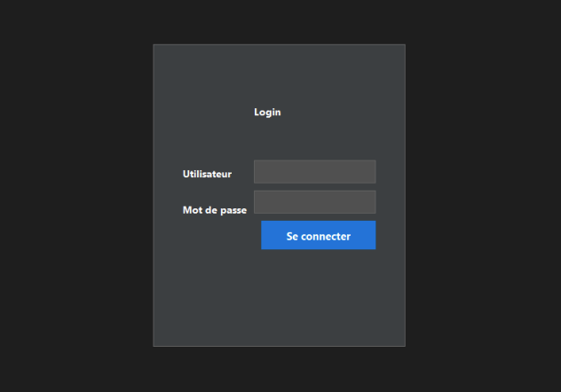
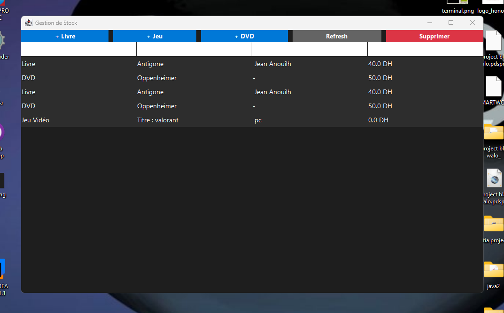

# Java Stock Management System

**Author:** Rami 


## 📋 Project Overview
This project is a desktop application designed to manage the inventory of a multimedia store. It allows for the tracking of various products (Books, DVDs, Video Games) using a **Polymorphic** architecture and persists all data in a **MySQL** database.

The goal was to move away from manual Excel files to a robust, centralized software solution that prevents data loss and pricing errors.

## ✨ Key Features
* **Secure Authentication:** Custom "Dark Mode" login interface replacing standard Swing colors with a modern dark grey theme (RGB 30,30,30).
* **Real-Time Dashboard:** A `JTable` interface allowing visualization of stock, prices, and specific attributes (Console for games, Author for books).
* **Polymorphism:** A single `save()` method detects the object type (`Livre`, `DVD`, `JeuVideo`) automatically using `instanceof`.
* **Database Integration:** Full connection to MySQL using JDBC for adding and deleting items.

## 🛠️ Tech Stack
* **Language:** Java (OOP principles used: Inheritance, Abstract Classes).
* **GUI:** Java Swing (Custom UI Styling).
* **Database:** MySQL.
* **Driver:** MySQL Connector/J (JDBC).

## 📸 Screenshots
### Custom Dark Mode Login

*Featuring custom GridBagLayout and dark background styling.*

### Inventory Dashboard

*Displays ID, Type, Title, Price, and specific attributes dynamically.*

## 💾 Database Structure
The project uses a single table `articles` with a discriminator column `type` to handle inheritance in SQL.

```sql
CREATE DATABASE gestion_stock;

USE gestion_stock;

CREATE TABLE articles (
    id INT PRIMARY KEY AUTO_INCREMENT,
    type VARCHAR(50),      -- Discriminator (Livre, DVD, Jeu)
    titre VARCHAR(100),
    prix DOUBLE,
    auteur VARCHAR(100),   -- Specific to Books (NULL for others)
    console VARCHAR(50)    -- Specific to Games (NULL for others)
);
